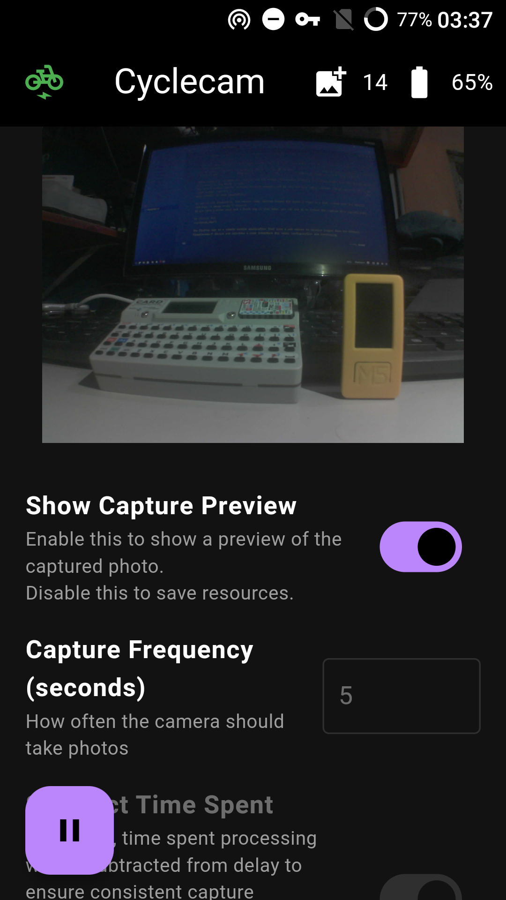

##  Cyclecam

A timelapse camera for cyclists using M5Stack TimerCamera-F and Flutter.

The project is designed to capture images at regular intervals while cycling, allowing users to create a timelapse video of their rides.

The project consists of three main components:

1. M5Stack TimerCamera-F firmware: the C++ code that runs on the M5Stack TimerCamera-F device, responsible for capturing images at specified intervals and transmitting them to a web server.
2. Flutter app: a mobile application that runs a web server to receive images from the M5Stack TimerCamera-F device and provides a user interface for basic configuration, such as setting the image capture interval and metadata.
3. O-ring mount for M5StickC-like devices: a 3D-printed mount that allows the M5Stack TimerCamera-F to be attached to a bicycle handlebar (or other rods) using a single o-ring.

## M5Stack TimerCamera-F Firmware
>m5-cyclecam/*

The firmware is written in C++ compatible with the Arduino IDE and is designed to run on the M5Stack TimerCamera-F device (it may also work on TimerCamera-X, but this has not been tested since I don't have one).

Assuming you already have familiarity with the Arduino IDE, you can build and upload the firmware by just installing the required libraries, opening the `m5-cyclecam.ino` sketch file, changing the board to *M5Stack/M5TimerCAM* and uploading it to the device.

Aside from the [M5Stack libraries](https://docs.m5stack.com/en/arduino/arduino_ide), the firmware requires only the [TimerCam](https://github.com/m5stack/TimerCam-arduino) library, which is the official library for the TimerCamera-F device.

>[!NOTE]
>At the time of initial development, the TimerCam library had some bugs that prevented the firmware from building.
>I have modified the library locally to fix these issues and also made a pull request to the original repository (which has already been merged, but does not seem to have been released yet).
>If you encounter build errors, please check the info that I already provided in the pull request [here](https://github.com/m5stack/TimerCam-arduino/pull/28).

Since the firmware is designed to send images to a web server, you will need to set up the Wi-Fi credentials and the server URL in the `configs.h` file. While you can use any Wi-Fi network, the project was designed to work with a mobile hotspot, so you can use your smartphone as a hotspot while cycling.

>[!NOTE]
>For now, the mobile hotspot is implemented on Android only (I don't even know if iOS supports exposing a web server on the hotspot).
>Since Android hotspots are generally set to use the IP address `192.168.43.1` by default, the only thing you need to change in the `configs.h` file is the `WIFI_SSID` and `WIFI_PASS` defines to match your hotspot credentials.

After uploading the firmware, you can use the M5Stack TimerCamera-F device to capture images automatically if manages to connect to the Wi-Fi network.
The device sleeps between captures to save battery, but it will not turn off completely unless you press the hidden reset button (see the [M5Stack TimerCamera-F documentation](https://docs.m5stack.com/en/unit/timercam_f#learn) for more details on this limitation).

As per my own experience, the device could capture images for about 2 hours on a full charge with the default settings (1 image every 5 seconds).
If you have a power bank and a frame bag on your bike, you can use it to extend the capture time significantly.

## Flutter App
>cyclecam_app/*

The Flutter app is a simple mobile application that runs a web server to receive images from the M5Stack TimerCamera-F device and provides a user interface for basic configuration (such as setting the image capture interval and metadata) and monitoring (such as showing the number of images captured and the current battery level of the device).

The app is designed to run on mobile devices, but since it is built with Flutter, it can also run on desktop platforms with some limitations (such as the lack of metadata support and the inability to expose a web server on a hotspot, only on a local network).

Assuming you have Flutter installed and configured (and also is familiar with it), you can run or build the app using the common `flutter run` or `flutter build` commands.

All photos are saved in the device's gallery (each session is saved in a separate album).
The timelapse video is not generated automatically, you will need to use a video editing software to create the timelapse video from the captured images (I recommend using [ffmpeg](https://ffmpeg.org/) for this task).

## O-ring Mount for M5StickC-like Devices
>o-ring-mount/*

The O-ring mount is a 3D-printed mount that allows the M5Stack TimerCamera-F to be attached to a bicycle handlebar (or other rods) using a single o-ring.

The design is based on the official mounts for M5StickC-like devices (such as the Lego and wall mounts).

The mount was designed using Dune3D and is available in STEP and STL formats (as well as the original Dune3D file, so you can modify it if needed, for example, to fit a different rod diameter).

I'm not a 3D printing expert, so I cannot assure that the mount will print correctly on all printers/materials, especially because I made some dimensions adjustments based on try-and-error (since I don't know how to configure tolerances and the like, and never used any filament other than PLA).

Both the STEP and STL files are already ready for printing (using the orientation that is less likely to break during use), so you can just slice them and print them without any additional modifications, just make sure to enable supports (I used tree supports).

The diameter of the O-ring may vary depending on the material it is made of and the diameter of the rod to which it will be attached. I tested it with a rigid O-ring with a diameter of 60 cm. I don't know what it's made of, but it's probably silicone.

>I'm not gonna lie, I always feared that the mount would break during use, but it never did, even after several rides on rough terrain.

By the way, you can also try to use the camera without the mount (in different situations) or with a different mount. When I first started testing both the firmware and the app, I used the M5StickC Plus watch belt to strap the camera to my left wrist, and it worked fine (although all the images were slightly tilted).
